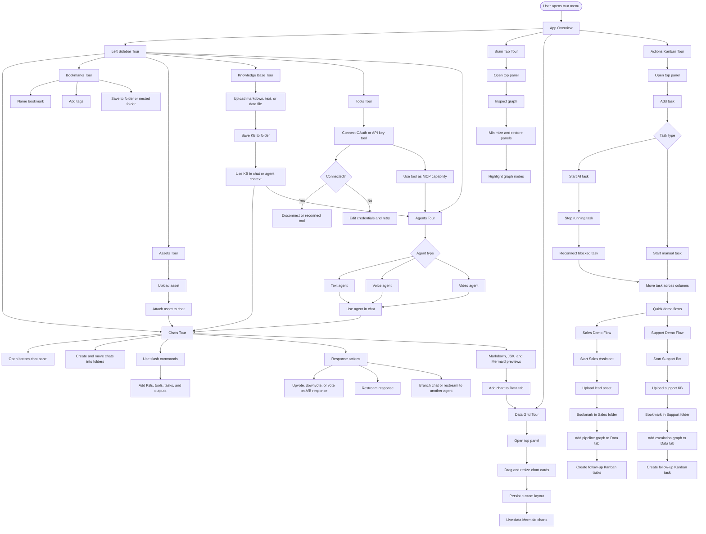

# App Guided Tours Plan

## Goal

Build a structured set of React Joyride tours that teach the app by workflow, not by isolated buttons. The tours should start from clear entry points, branch into nested tutorials, and let users run short focused demos for sales and support use cases.

## Tour System Structure

Use the existing `AppTourProvider` as the central tour registry.

- Store tours by ID: `app-overview`, `left-sidebar`, `chats`, `bookmarks`, `assets`, `knowledge-base`, `tools`, `agents`, `brain`, `data-grid`, `actions-kanban`, `sales-demo`, `support-demo`.
- Add `startTour(tourId)` instead of only `startTour()`.
- Keep each tour as an array of Joyride steps.
- Use stable `data-tour` attributes for every target.
- Add nested tour launch actions from the final step of parent tours.
- Persist completed tour IDs in local storage.
- Add a Tours menu in chat settings so users can replay any tour.

## Required Tour Entry Points

- Sidebar help icon: starts `app-overview`.
- Chat settings: add a `Tours` folder/section with all available tours.
- Empty state cards: offer relevant tours when no chats, assets, KBs, tools, or agents exist.
- Quick demo cards: `Sales Flow` and `Support Flow`.

## Tour List

### 1. App Overview

Purpose: introduce the app shell.

Steps:
- Sidebar header and search.
- New Chat and Bookmark actions.
- Main workspace.
- Top panel tabs.
- Data tab.
- Brain tab.
- Actions/Kanban tab.
- Agents, Assets, Knowledge Base, Tools.

Nested starts:
- `left-sidebar`
- `brain`
- `data-grid`
- `actions-kanban`

### 2. Left Sidebar

Purpose: teach the structure of the left rail.

Steps:
- Chats accordion.
- Bookmarks accordion.
- Assets accordion.
- Knowledge Base accordion.
- Tools accordion.
- Agents accordion.
- Active sessions.

Nested starts:
- `chats`
- `bookmarks`
- `assets`
- `knowledge-base`
- `tools`
- `agents`

### 3. Chats

Purpose: teach basic chat use.

Steps:
- New Chat button.
- Chat settings.
- Open the bottom chat panel when it is minimized.
- Explain the bottom panel layout: message list, composer, response actions, previews, and settings.
- Text input.
- Use `/` commands from the composer.
- Open the slash command menu and filter commands by typing.
- Run `/` commands for adding KBs, connecting tools, creating tasks, and adding visual outputs.
- Send message.
- Chat response bubbles.
- Upvote and downvote a response.
- Vote on an A/B response when multiple candidate responses are shown.
- Restream/regenerate a response.
- Branch a response into a new chat thread.
- Branch or restream a response to another agent.
- Markdown rendering.
- Custom previews for JSX and Mermaid.
- Add generated output to Data tab.

Also update chat settings:
- Add a `Folders` section for organizing chats.
- Add create folder, select folder, move chat to folder, and rename folder controls.

### 4. Bookmarks

Purpose: teach saving and organizing chats.

Steps:
- Bookmark current chat/session.
- Name the bookmark.
- Add tags.
- Select existing folder.
- Create new folder.
- Save bookmark.
- Open bookmarked chat.
- Use bookmark folder 3-dot menu.
- Move folder under another folder.
- Delete bookmark or folder.

### 5. Assets

Purpose: teach uploads and chat attachments.

Steps:
- Open Assets accordion.
- Upload file.
- Preview asset.
- Attach asset to current chat.
- Remove asset from chat draft.
- Delete asset.
- Use pagination/layout controls.

### 6. Knowledge Base

Purpose: teach context uploads and usage in chat.

Steps:
- Open Knowledge Base accordion.
- Create KB folder.
- Upload markdown, text, or data file.
- Select folder during upload.
- Open KB item.
- Add KB/context to chat settings.
- Use KB in a text/voice/video agent.
- Move KB item to another folder.
- Delete KB item.

### 7. Tools

Purpose: teach external tool connections.

Steps:
- Open Tools accordion.
- Search tools.
- Filter by All, OAuth, API Key.
- Open Connect Tool modal.
- Read capabilities/info tooltip.
- Connect tool.
- Reconnect tool.
- Disconnect tool.
- Use connected tool in chat/agent MCP settings.

### 8. Agents

Purpose: teach creating and using text, voice, and video agents.

Steps:
- Open Agents accordion.
- Create Agent.
- Profile section.
- Select chat type.
- Text-only agent settings.
- Voice agent provider and voice settings.
- Video agent avatar, voice, context, quality, and session settings.
- MCP server badges.
- Context uploads and permissions.
- Save agent.
- Start chat with agent.
- Edit existing agent.

Rules to explain:
- Text and Voice can be selected together.
- Video is exclusive and unselects Text/Voice.
- LiveAvatar options appear only for Video agents.

### 9. Brain Tab

Purpose: teach the top panel Brain view.

Steps:
- Open the top panel.
- Open Brain tab.
- Explain graph controls.
- Maximize/minimize panel controls.
- Zoom controls.
- Highlight graph nodes.
- Add alternate view panel.
- Collapse side/top/bottom panels.
- Restore minimized panels.

### 10. Data Grid

Purpose: teach adding charts from chat and configuring layouts.

Steps:
- Open the top panel.
- Open Data tab.
- Add Mermaid chart from chat 3-dot menu.
- Confirm chart appears in Data tab.
- Resize chart.
- Drag chart.
- Save persistent layout.
- Reset layout.
- Add live-data Mermaid chart.
- Configure responsive layout.

### 11. Actions Kanban

Purpose: teach task/action workflows.

Steps:
- Open the top panel.
- Open Actions tab.
- View Kanban board.
- Add task.
- Choose AI task or Manual task.
- Fill task modal.
- Start an AI task.
- Start a manual task.
- Stop a running task.
- Reconnect or reconfigure a task that is blocked by missing credentials or stale tool settings.
- Move task between columns.
- Add labels/tags.
- Filter or search tasks.
- Create board/folder if supported.
- Use task actions menu.

### 12. Sales Demo Flow

Purpose: provide a quick guided demo for a sales workflow.

Flow:
- Start Sales Assistant agent.
- Upload lead sheet as asset.
- Attach asset to chat.
- Ask agent to qualify leads.
- Save response as bookmark in `Sales` folder.
- Add Mermaid pipeline chart to Data tab.
- Resize chart layout.
- Create follow-up tasks in Actions Kanban.
- Connect CRM/email tools if available.

### 13. Support Demo Flow

Purpose: provide a quick guided demo for support workflow.

Flow:
- Start Support Bot agent.
- Upload support FAQ as knowledge base.
- Add KB/context to chat settings.
- Ask support question.
- Bookmark resolved chat in `Support` folder.
- Add escalation graph to Data tab.
- Create follow-up Kanban task.
- Connect ticketing or docs tools if available.

## Needed `data-tour` Targets

Add or verify these targets:

- `sidebar-header`
- `tour-start`
- `search-conversations`
- `new-chat`
- `bookmark-current`
- `chats-section`
- `bookmarks`
- `assets`
- `knowledge-base`
- `tools`
- `agents`
- `active-sessions`
- `main-workspace`
- `bottom-chat-panel`
- `bottom-chat-panel-toggle`
- `chat-settings`
- `chat-folders`
- `chat-input`
- `slash-command-menu`
- `slash-command-item`
- `message-list`
- `message-actions`
- `message-upvote`
- `message-downvote`
- `message-ab-vote`
- `message-restream`
- `message-branch`
- `message-branch-agent`
- `markdown-preview`
- `mermaid-preview`
- `top-panel-toggle`
- `top-panel`
- `top-panel-tabs`
- `brain-tab`
- `brain-graph`
- `brain-controls`
- `data-tab`
- `data-grid`
- `data-grid-layout-controls`
- `actions-tab`
- `kanban-board`
- `kanban-add-task`
- `kanban-task-type`
- `kanban-start-ai-task`
- `kanban-start-manual-task`
- `kanban-stop-task`
- `kanban-reconnect-task`
- `agent-create`
- `agent-chat-type`
- `agent-context`
- `agent-mcp`
- `tool-connect-modal`

## Mermaid Tour Map

## Implementation Order

1. Extend `AppTourProvider` to accept `startTour(tourId)`.
2. Add a tour registry file with all tour step arrays.
3. Add missing `data-tour` targets.
4. Add Tours section inside chat settings.
5. Add chat folder support in chat settings.
6. Add nested tour actions at the end of parent tours.
7. Add quick demo cards for Sales Flow and Support Flow.
8. Persist completed tours and show replay controls.
9. Test tours on desktop and mobile sidebar states.

## Acceptance Criteria

- Every major workflow has a replayable tour.
- Parent tours can launch nested tours.
- Users can learn sidebar, chats, bookmarks, assets, KBs, tools, agents, Brain, Data, and Actions without reading docs.
- Sales and Support demos begin from their own cards and walk through complete workflows.
- Tour overlays appear above modals, sidebars, graph controls, and data grid cards.
- Tours skip missing targets gracefully.
- TypeScript passes after implementation.
